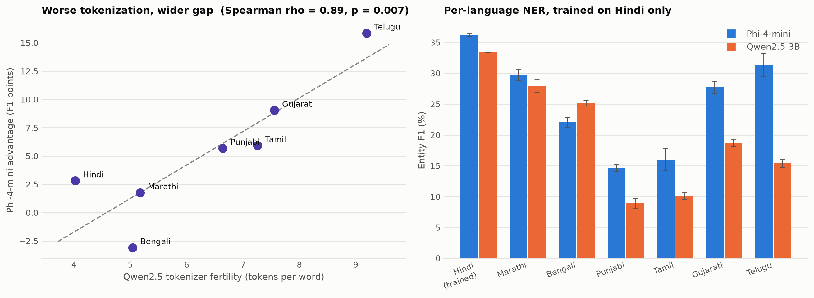

# Does Tokenizer Fertility Predict Indic NER Quality?

Two similarly-sized SLMs from different families are LoRA-fine-tuned for named
entity recognition on Hindi and evaluated on seven Indic languages. The question
is whether how badly a tokenizer fragments a script predicts how far behind that
model falls on it.



| | |
|---|---|
| **Model A** | `microsoft/Phi-4-mini-instruct` — 3.84B params |
| **Model B** | `Qwen/Qwen2.5-3B-Instruct` — 3.09B params |
| **Data** | [`ai4bharat/naamapadam`](https://huggingface.co/datasets/ai4bharat/naamapadam) — PER / ORG / LOC |
| **Setup** | Train on Hindi, evaluate on 7 languages (6 zero-shot), 4-bit QLoRA, 3 seeds |
| **Metric** | Entity-level strict precision / recall / F1 (seqeval) |

Sizes are close enough that the variable under study is the tokenizer and
pretraining mix rather than parameter count.

## Result

**Qwen2.5 fragments Indic scripts 1.9–2.9x more than Phi-4-mini**, and the
languages it fragments worst are the languages it loses on. Spearman
**rho = 0.89 (p = 0.007)** between Qwen's fertility on a language and Phi's F1
advantage there. Telugu is the extreme on both axes: 9.19 tokens per word, and a
15.9-point F1 deficit.

**The gap is not an artifact of undertraining.** Repeating the study with 5x the
training data moves the mean gap from **+5.43 to +5.70** F1 points — it persists
and slightly widens.

### Tokenizer fertility (subword tokens per word)

| Language   | Script     |   Phi-4-mini |   Qwen2.5 |   Ratio |
|:-----------|:-----------|-------------:|----------:|--------:|
| Hindi      | Devanagari |        2.063 |     4.02  |    1.95 |
| Marathi    | Devanagari |        2.717 |     5.173 |    1.9  |
| Bengali    | Bengali    |        2.569 |     5.039 |    1.96 |
| Punjabi    | Gurmukhi   |        2.812 |     6.638 |    2.36 |
| Tamil      | Tamil      |        3.258 |     7.257 |    2.23 |
| Gujarati   | Gujarati   |        2.674 |     7.554 |    2.82 |
| Telugu     | Telugu     |        3.147 |     9.19  |    2.92 |


### Entity F1 (%) — 4,000 training sentences, 3 seeds (mean ± std)

| Language               | Phi-4-mini   | Qwen2.5-3B   |   Gap |   Qwen fertility |
|:-----------------------|:-------------|:-------------|------:|-----------------:|
| Hindi                  | 36.20 ± 0.23 | 33.38 ± 0.05 |  2.81 |            4.02  |
| Marathi *(zero-shot)*  | 29.76 ± 0.96 | 28.00 ± 1.02 |  1.75 |            5.173 |
| Bengali *(zero-shot)*  | 22.07 ± 0.79 | 25.16 ± 0.46 | -3.09 |            5.039 |
| Punjabi *(zero-shot)*  | 14.65 ± 0.53 | 8.97 ± 0.79  |  5.68 |            6.638 |
| Tamil *(zero-shot)*    | 16.02 ± 1.84 | 10.11 ± 0.51 |  5.91 |            7.257 |
| Gujarati *(zero-shot)* | 27.76 ± 0.97 | 18.71 ± 0.53 |  9.05 |            7.554 |
| Telugu *(zero-shot)*   | 31.33 ± 1.88 | 15.47 ± 0.65 | 15.86 |            9.19  |


Spearman correlation, Qwen fertility vs F1 gap: **rho = 0.893, p = 0.007** (n = 7 languages)


### Entity F1 (%) — 20,000 training sentences, 1 seed (single run)

| Language               |   Phi-4-mini |   Qwen2.5-3B |   Gap |   Qwen fertility |
|:-----------------------|-------------:|-------------:|------:|-----------------:|
| Hindi                  |        41.29 |        37.38 |  3.91 |            4.02  |
| Marathi *(zero-shot)*  |        30.83 |        27.66 |  3.17 |            5.173 |
| Bengali *(zero-shot)*  |        24.81 |        28.64 | -3.84 |            5.039 |
| Punjabi *(zero-shot)*  |        15.26 |        10.25 |  5.01 |            6.638 |
| Tamil *(zero-shot)*    |        17.5  |        10.56 |  6.95 |            7.257 |
| Gujarati *(zero-shot)* |        29.94 |        23.25 |  6.69 |            7.554 |
| Telugu *(zero-shot)*   |        34.31 |        16.3  | 18.01 |            9.19  |


Spearman correlation, Qwen fertility vs F1 gap: **rho = 0.857, p = 0.014** (n = 7 languages)


### Training cost — 4,000 sentences (gradient checkpointing on)

| Model      |   Train tokens |   Wall clock (s) |   Tokens/s |   Peak VRAM (GB) |   Trainable params |
|:-----------|---------------:|-----------------:|-----------:|-----------------:|-------------------:|
| phi-4-mini |        367,284 |           1710.1 |      214.8 |             6.14 |         23,090,183 |
| qwen2.5-3b |        716,016 |           1398   |      512.2 |             8.33 |         29,947,911 |


### Training cost — 20,000 sentences (gradient checkpointing off)

| Model      |   Train tokens |   Wall clock (s) |   Tokens/s |   Peak VRAM (GB) |   Trainable params |
|:-----------|---------------:|-----------------:|-----------:|-----------------:|-------------------:|
| phi-4-mini |      1,855,840 |            992.4 |     1870.1 |            13.18 |         23,090,183 |
| qwen2.5-3b |      3,617,844 |           1479.8 |     2444.9 |            27.29 |         29,947,911 |

## Cost: the penalty is tokens and memory, not necessarily wall clock

Qwen processes **1.95x the training tokens** for the same 4,000 sentences —
exactly its Hindi fertility ratio (4.02 / 2.06 = 1.95), which is a useful
internal consistency check on the measurement.

Whether that costs wall-clock time depends on the configuration:

- **With gradient checkpointing** (compute-bound): Qwen *finished faster*
  (1398s vs 1710s) despite 2x the tokens, because it is the smaller model and
  ran at 2.4x the throughput.
- **Without gradient checkpointing** (memory-bound): Qwen took 1480s vs Phi's
  992s and needed **27.3 GB against 13.2 GB** — the longer sequences dominate.

So the honest statement is that fertility always costs tokens and context
budget; it costs time only when you are not compute-bound elsewhere. Reporting
only one configuration would have supported the opposite headline.

## The Bengali anomaly

Bengali is the one language where Qwen *wins* (+3.1 F1 at 4k, +3.8 at 20k),
despite a fertility of 5.04. Removing it raises the correlation to rho = 0.94.
This study does not explain it — the most likely cause is that Qwen's
pretraining mix contains proportionally more Bengali than its tokenizer
coverage suggests, but that is a hypothesis, not a finding.

## Important caveat: fertility and pretraining exposure are confounded

A model whose tokenizer covers Telugu well has almost certainly also *seen* more
Telugu during pretraining — vocabularies are learned from the pretraining corpus.
This study therefore shows that fertility **predicts** the gap, not that it
**causes** it. Separating the two would need either two models pretrained on the
same corpus with different tokenizers, or a vocabulary-transplant experiment.

## Layout

```
src/config.py       models, languages, label set
src/data.py         naamapadam loader (works around the removed loading script)
src/fertility.py    tokens-per-word measurement, the independent variable
src/ner.py          label alignment, QLoRA training, entity-level scoring
src/run.py          experiment driver (resumable)
src/report.py       raw CSVs -> results/tables.md
src/make_figure.py  render results/fertility_vs_f1.png
```

Two things worth knowing if you run this:

- **`ai4bharat/naamapadam` still ships a loading script**, which `datasets` 3.x+
  refuses to run. `src/data.py` resolves HF's automatic Parquet conversion
  through the datasets-server API and loads that instead.
- **The classification head must stay unquantized.** PEFT's `TOKEN_CLS` task puts
  it in `modules_to_save`, and a 4-bit Linear there fails inside bitsandbytes.
- **`prepare_model_for_kbit_training` is deliberately not used.** It upcasts every
  non-quantized parameter to fp32, and Phi-4-mini's ~200k-token embedding alone
  is 2.4 GB that way. Gradient checkpointing is enabled directly instead, which
  cut peak VRAM from 5.15 GB to 3.56 GB.

## Reproduce

```bash
pip install -r requirements.txt
python src/fertility.py
python src/run.py --n_train 4000 --epochs 2          # add --resume to continue
python src/report.py
python src/make_figure.py
```

Run on one NVIDIA RTX 6000 Ada (48 GB) shared with other jobs; PyTorch 2.6 +
CUDA 12.4, transformers 5.17.

## Limitations

- **Absolute F1 is low** — 36% on Hindi at 4k sentences, 41% at 20k. Three
  reasons. First, naamapadam's *training* labels are machine-generated: entities
  were projected from the English side of a parallel corpus onto the Indic side
  by word alignment, so they carry alignment noise, while the *test* sets are
  manually annotated. Training on noisy labels and scoring against clean ones
  caps the achievable score regardless of budget. Second, this uses only 0.4–2%
  of the 985k available Hindi sentences. Third, a decoder LM with a
  token-classification head is not the natural architecture for NER. The study
  is a controlled comparison under a fixed budget, not a leaderboard attempt.
  The train/test annotation asymmetry cuts the right way for the comparison:
  because the test labels are human-made, the evaluation measures NER quality
  rather than which model better fits the projection noise.
- **Seven languages is a small n**, and they are not independent — Hindi and
  Marathi share Devanagari. The correlation is suggestive, not conclusive.
- **The 20k convergence check is a single seed** per model.
- **Fertility is confounded with pretraining exposure**, as described above.
- Both models were trained in 4-bit; a bf16 run might shift absolute numbers.

## License

MIT
